# Dicas de anotações em árvore sintática que causam dúvidas nos anotadores com explicações em português #

## Faculdade de Ciências e Letras da UNESP de Araraquara e CNPq (proc.n.307431/2019-3 e proc. 432895/2018-3) 
### Sumário

[I.Motivação](#imotivação)

[II.Principais diferenças entre AGDT 1.0 e AGDT 2.0  ](#iiprincipais-diferenças-entre-agdt-10-e-agdt-20)

[III. Situações gramaticais específicas](#iii-situações-gramaticais-específicas)

[1. Infinitivo como complemento de adjetivos](#-1-infinitivo-como-complemento-de-adjetivos)

- [Uso de infinitivo complemento de adjetivo no Ragon](#-uso-de-infinitivo-complemento-de-adjetivo-no-ragon-)
- [Exemplo como ADV](#exemplo-como-adv--capaz-para)
- [Exemplo como OBJ](#-exemplo-como-obj--merecer-)

[2. Verbos de ligação ou Cópula cujo atributo é anotado como PNOM](#-2-verbos-de-liga%C3%A7%C3%A3o-ou-c%C3%B3pula-cujo-atributo-%C3%A9-anotado-como-pnom)

[3. Acusativo de relação dependendo de adjetivo como ADV](#-3-acusativo-de-rela%C3%A7%C3%A3o-dependendo-de-adjetivo-como-adv-)

### I.Motivação

Em geral,  anotadores iniciantes do AGDT da área de letras clássicas não estão familiarizados com a anotação em treebank de dependência e percebem conflitos com a intuição sintática que trazem da língua materna. Além disso, estão lidando com textos diversos de gêneros, estilos e épocas diferentes e podem encontrar estruturas sintáticas que podem gerar dúvidas em virtude do sentido empregado ou imaginado pelo autor. Assim, a anotação obriga o anotador a buscar mais informações sobre o texto específico a ser anotado. As convenções no AGDT 1.0 e 2.0 não dão conta de toda a complexidade da língua grega que pode surgir nos textos a serem anotados. Por esse motivo, estamos reunindo alguns casos específicos de anotação sobre os quais apareceram dúvidas durante as atividades realizadas em sala de aula e que são encontrados em publicações anteriores, cujas decisões são sustentadas por comentários, gramáticas e dicionários da língua grega e como as convenções das *guidelines* tratam esses casos. 

Pontuemos inicialmente as principais diferenças entre as diretrizes do AGDT 1.0 e 2.0. Elas residem na aplicação das etiquetas APOS, PA, ATV e AtvV. 

### II.Principais diferenças entre AGDT 1.0 e AGDT 2.0 

#### APOS 

* <h4>No AGDT 1.0 </h4>

### III. Situações gramaticais específicas 

<h2> 1. Infinitivo como complemento de adjetivos</h2>

O manual AGDT do treebank recomenda anotar com etiqueta OBJ não só os infinitivos como complementos verbos (orações completivas) como também quando *complementam adjetivos* embora haja alguns exemplos como ADV. Isso porque na gramática do Smyth esse infinitivo teria um uso análogo ao infinitivo que modifica certos verbos que indicam finalidade, adequação, habilidade, facilidade, etc cf. [Smyth Grammar § 2001-2002](http://www.perseus.tufts.edu/hopper/text?doc=Perseus%3Atext%3A1999.04.0007%3Asmythp%3D2002). Assim, temos: 

> *2001 O infinitivo serve para definir o significado de adjetivos, advérbios e substantivos, especialmente aqueles que denotam habilidade, aptidão, capacidade, etc. (e seus opostos), e geralmente aqueles análogos em significado aos verbos que tomam o infinitivo (2000). Aqui o significado de dativo (propósito, destino) é muitas vezes aparente. Cp. 1969.*a. Some of these adjectives take the infinitive by analogy to the related verbs, as πρόθυμος zealous (προθυμοῦμαι), ἐπιστήμων knowing how (ἐπίσταμαι)"*. 
>> *1969. O infinitivo era originalmente um substantivo verbal no caso dativo (em parte possivelmente também no locativo). O uso para expressar propósito (2008) é uma sobrevivência do significado primitivo, do qual todos os outros usos amplamente divergentes foram desenvolvidos de maneira nem sempre clara para nós. Mas o significado **para** (to e for) visto em μανθάνειν ἥκομεν  'viemos aprender' (para aprender) também pode ser discernido em δύναμαι ἰδεῖν, 'Tenho poder para ver', então, 'posso ver'. Cp. 2000, 2006 a. Já em Homero, quando o significado do dativo foi parcialmente obscurecido, o infinitivo foi empregado como nominativo (como sujeito) e acusativo (como objeto). Depois de Homero, o infinitivo passou a ser usado com o artigo neutro, a ideia substantiva ganhando assim definição. O artigo deve ser usado quando o infinitivo está como objeto no genitivo ou dativo, e quando depende de preposições*

Por isso, trazemos os dois modos de anotação já registrados: como ADV (modificador opcional, como princípio geral) e como OBJ (complemento obrigatório, como princípio geral) abaixo. Supõe-se que, como ADV, está presente a ideia de finalidade, que seria adicional; como OBJ, está presente a ideia de que o verbo substituído pelo adjetivo não poderia prescindir do complemento. Achamos a diferença muito sutil e depende do sentido da ação verbal implícita.

* <h3> Uso de infinitivo complemento de adjetivo no Ragon </h3>
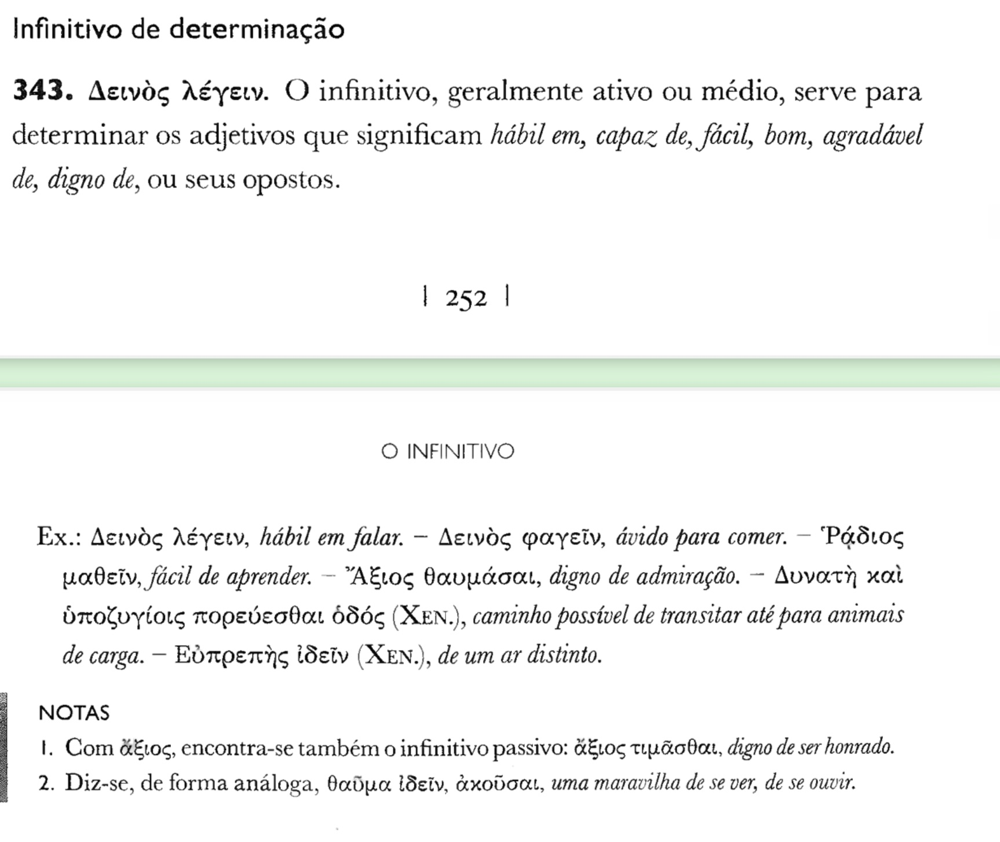

* <h3>Exemplo como ADV (= capaz para)</h3>
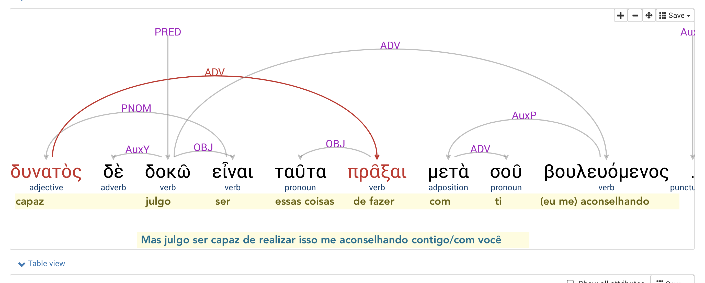

* <h3> Exemplo como OBJ (= merecer ...)</h3> 
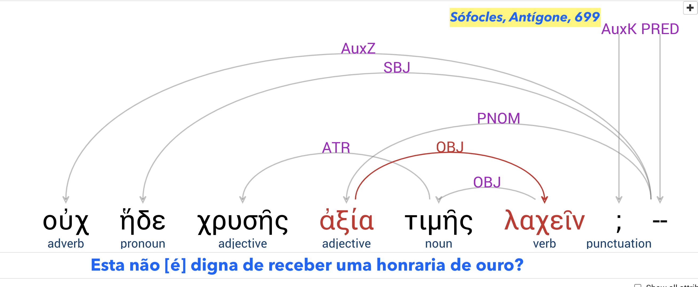

<h2> 2. Verbos de ligação ou Cópula cujo atributo é anotado como PNOM</h2>

A Smyth Grammar contém uma pequena lista de verbos de ligação, ver: 
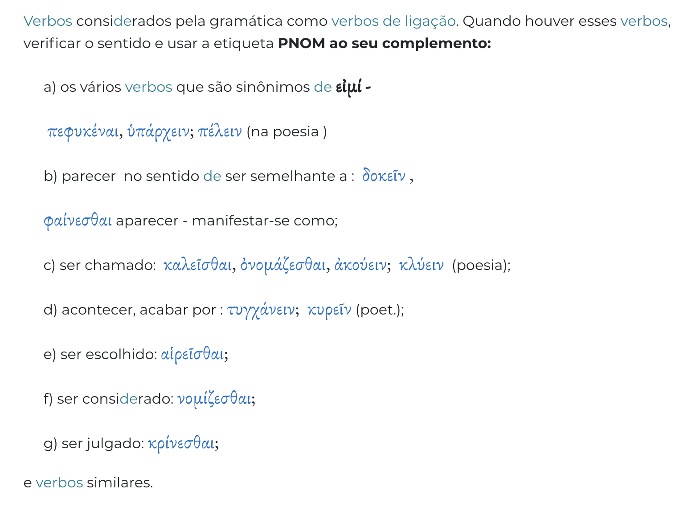 

**O texto didático da Gildersleeve Grammar traz exemplos e a lista pode ser expandida**, ver: 
[Copula](https://www.perseus.tufts.edu/hopper/text?doc=Perseus:text:1999.04.0074:section=5)

>[*] *64. Verbos copulativos. 
Outros verbos copulativos são: “ἀκούειν”, “διατελεῖν”, "δύνασθαι", “καθίστασθαι” = “γἱγνεσθαι” (muitas vezes em oradores) “κυρεῖν”, calhar, "λαγχάνειν", “μένειν”, permanecer, "πέλειν, πέλεσθαι", "τελέθειν", “τυγχάνειν”, acontecer, “ὑπάρχειν”, ser, "φαίνομαι", aparecer, “Φῦναι”, comp. fuisse, etc.
>>Nos melhores dias da língua, verbos como “καθίστασθαι, τυγχάνειν, ὑπάρχειν” e “φῦναι” não são meros fluxos para o predicado. O uso frequente de “φῦναι” e “τυγχάνειν” surge da divisão grega de toda manifestação nas duas esferas de “φύσις” e “τύχη”. Em “ὑπάρχειν”, que acabou por se descolorir, a ideia de base, de algo a que recorrer, de recurso ou resíduo, não foi totalmente apagada no bom período.

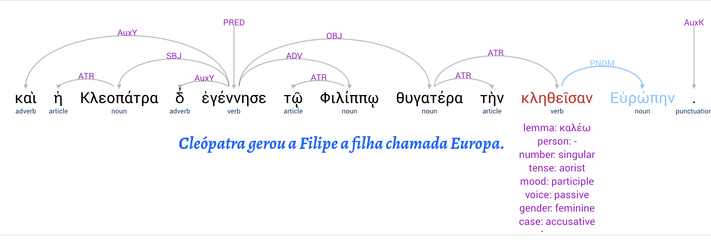

**Observação:** Quando um verbo de ligação predicativo depende de outro verbo de ligação teremos dois PNOMs, como na figura abaixo.

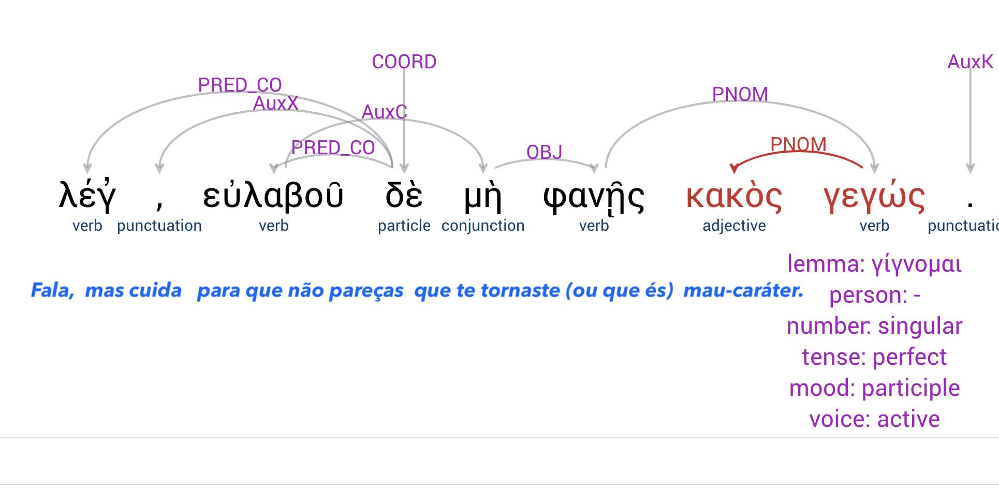 

* <h3> Alguns verbos podem ou não ser usados como verbos de ligação e, às vezes, se usam na forma da voz ativa quando pedem predicativo PNOM. </h3>
Parece ser o caso do verbo τυγχάνω  e  δοκέω que teriam complemento verbal obrigatório e, por isso, εἰμί recebe etiqueta OBJ. A diferença pode ser sutil, mas as anotações de εἰμί como OBJ e seu complemento PNOM são mais numerosas do que haver dois PNOMs.

**εἶναι é PNOM**

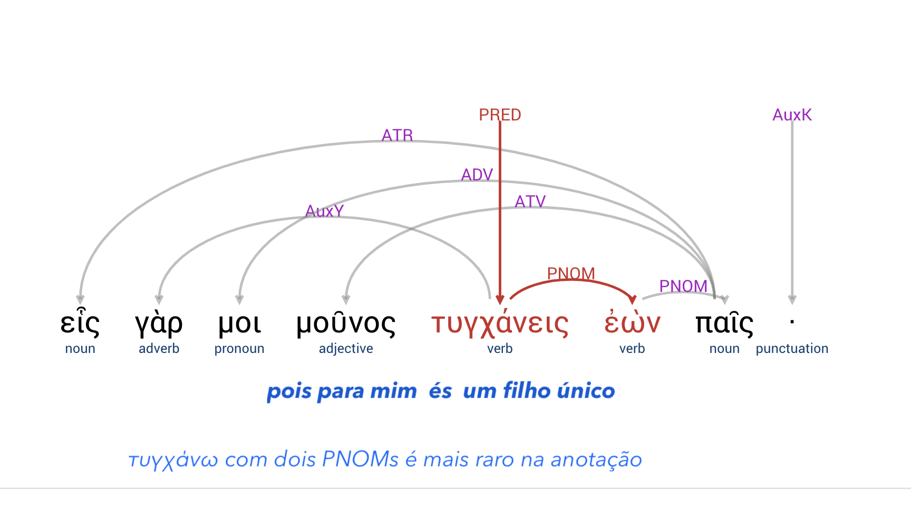 

**εἶναι  é OBJ**

 

**εἶναι é OBJ**

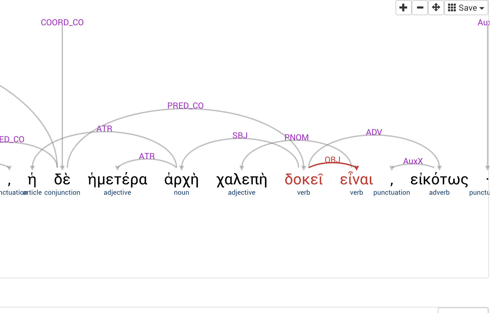 

**εἶναι é PNOM**

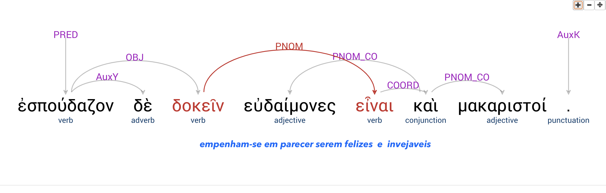

* <h3> Outros verbos de ligação pedem predicativo em dois PNOMs só quando em sentido passivo  </h3>
Com o verbo **νομίζω** por exemplo, em  _ϳulgando  julgado ser_, ou acreditando ser καλὸν εἶναι νομιζόμενόν - "ser" será OBJ. Já quando se refere a costume e uso, poderá pedir PNOM.

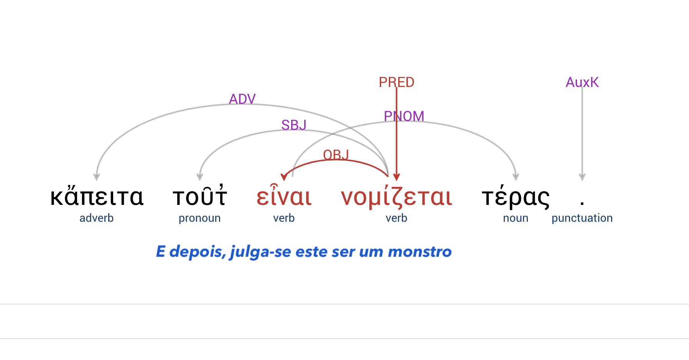
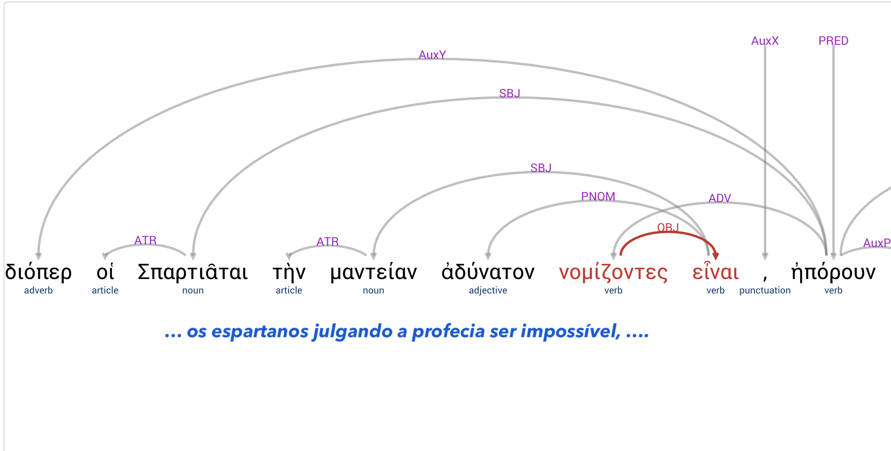

<h2> 3. Acusativo de relação dependendo de adjetivo como ADV </h2>

O acusativo de relação ou de respeito expressa a forma em que se dá a ação, e dependerá do adjetivo ou verbo como um complemento adicional e etiquetado ADV e será anotado como ADV. Pode também estar mediado por uma preposição, i.e., ser "adposicional". 

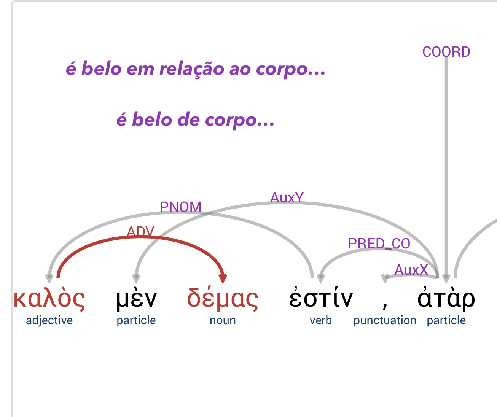

<h2>4. Artigo e pronome seguido de particípio no mesmo caso</h2>

* <h3> Em sentenças com particípio articulado sem substantivo:</h3>

o artigo recebe a etiqueta ATR, e o particípio recebe a etiqueta correspondente à função (v. §366 Ragon):

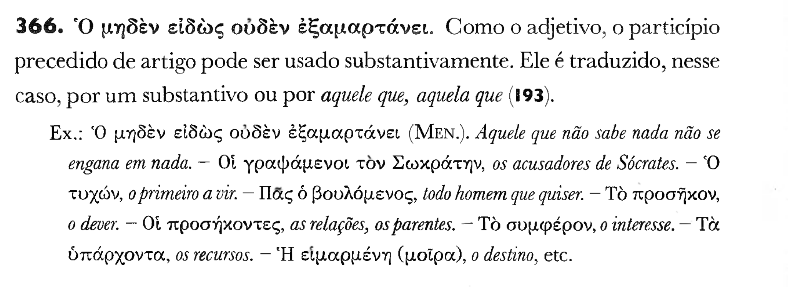

Abaixo:  _O que se coroou percorreu (os tempos) dos deuses_ (Plutarco, _Licurgo_, 26.3)

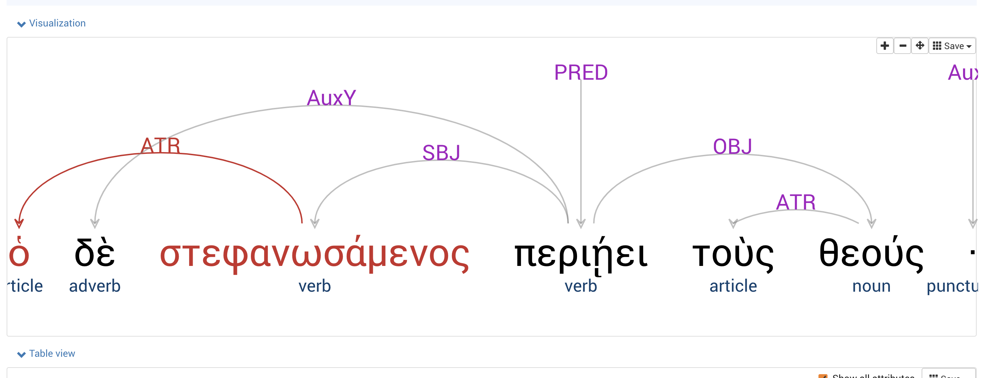 

* <h3> Em sentenças com pronome indefinido com particípio</h3>

O particípio recebe a etiqueta ATR (oração adjetiva) e o pronome indefinido recebe a etiqueta correspondente à função sintática:

Abaixo: _Alguém que seja sensato saiba isso._ (Sófocles, _Ájax_, 416)

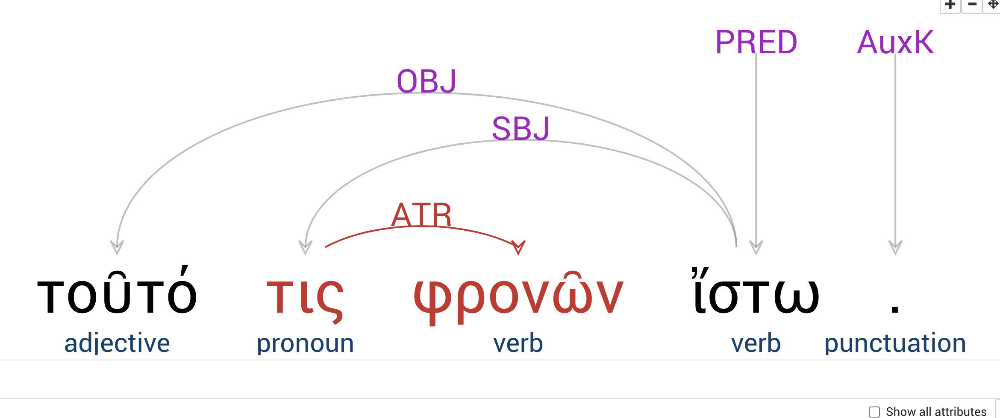

